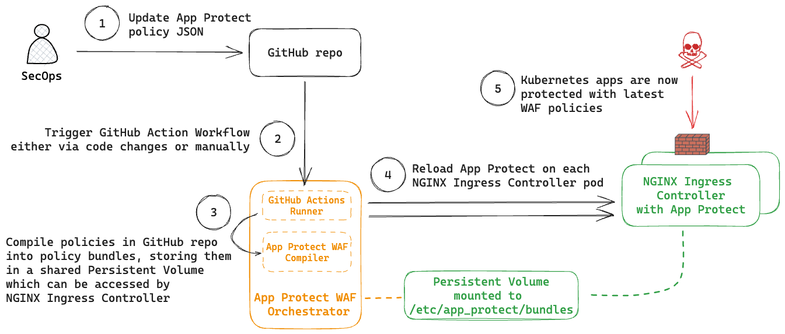

# App Protect WAF Orchestrator For NGINX Ingress Controller

NGINX App Protect WAF 5 introduces an architectural change which decouples WAF policy management from NGINX Ingress Controller operations. This repository showcases an implementation of how the App Protect WAF policies can be managed using a policy-as-code approach and continous deployment (CD) pipelines.

## How it works



An orchestrator pod is deployed in the Kubernetes cluster where NGINX Ingress Controller lives, mounting the same Persistent Volume that NGINX Ingress Controller uses to access App Protect policy bundles (in `/etc/app_protect/bundles`). The orchestrator performs the following:
- monitors a GitHub repository for changes to App Protect policies using GitHub Actions
- compiles App Protect policies in JSON format to `.tgz` bundles
- runs `apreload` on the NGINX Ingress Controller to load the newly compiled bundles into runtime

## Repository Structure
Included in this repository are
- a [Docker build](docker/) to create a orchestrator image
    The image uses the waf-compiler as a base, with GitHub Action runner deployed on top
- a [Helm chart](helm/app-protect-waf-orchestrator/) to deploy said image into a Kubernetes where NGINX Ingress Controller is running
- an example showcasing [App Protect policies stored in a repository](examples/), along with [GitHub Action workflows](.github/workflows/) to process the policies

## Getting Started

### Building Orchestrator Image

Create a `docker/.env` file based on [docker/example.env](docker/example.env) and modify values in it as required.

```
docker compose --project-directory=docker/ build
```

Once the image has been built, publish it to a registry where your Kubernetes cluster can pull from

### GitHub Action pre-requisite

On startup, the pod runs a GitHub Action runner configuration script to dynamically register itself as a self-hosted runner for a target GitHub repository. To do so, it needs to be provided with a [fine-grained Personal Access Token (PAT)](https://docs.github.com/en/authentication/keeping-your-account-and-data-secure/managing-your-personal-access-tokens#creating-a-fine-grained-personal-access-token) with following Repository permissions:
- **Read** access to metadata
- **Read** and **Write** access to administration

Next, create a Kubernetes secret with the PAT, in the namespace where the App Protect Orchestrator would be deployed
```
kubectl -n nginx-ingress create secret generic github-pat --from-literal token=<GHPAT>
```

### Deploying Runner

Using [helm/values.yaml](helm/values.yaml) as reference, create a `values.yaml` file for deploying the orchestrator.

Then, deploy the orchestrator into Kubernetes using Helm
```
helm -n nginx-ingress install -f values.yaml app-protect-waf-orchestrator helm/app-protect-waf-orchestrator
```
